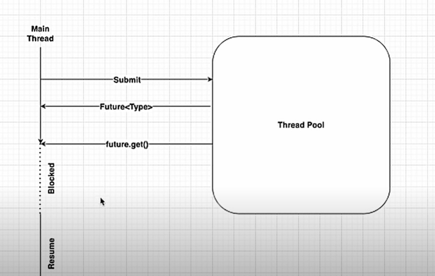

# Callable Thread

There are two ways to create threads.
    
    i. Implements Runnable interface
    ii. Extends Thread class

In both, return type is void. So it is not returnable. To archive return feature we can create thread implementing ```Callable``` interface.

With using executor service we can run this callable task using ```submit()``` method.
It accepts runnable and callable threads.
But ```execute()``` method only accept runnable threads.

From callable threads are return ```Future<>``` object. After that we can get the actual result from using 
```get()``` method.

Eg :

```
    Future<Integer> result = service.submit(new CallableThread());
    System.out.println(result.get());
```



As the picture describe, after submitting we got a ```Future<Type>``` value. It is just like a placeholder.
Once ```future.get()``` is called, first it checks that value is got or not.

if got, then nothing special happen.

if not, then main thread will be blocked until value is got. after that main thread is resume.

We can add a waiting time to ```future.get()``` method. After time is over, we can resume the main thread by handling the error.
```future.get(1, TiemUnit.SEONDS)``` with this after 1 second it throw a 
```TimeoutException```.

We can cancel that callable thread as well by ```future.cancel()```
There are some more methods to work with callable threads.

    i. future.isDone()
    ii. future.isCancelled()