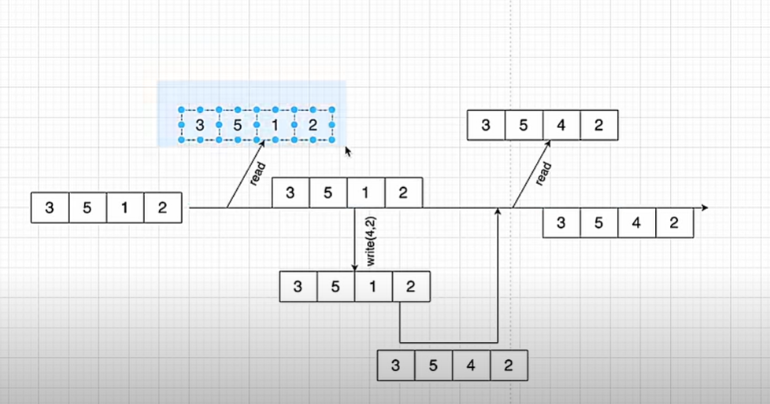

# Copy On Write Array

This array is used to read and write on concurrent processes. Without making any interruption this array handle all read and write operations.

The mechanism behind this as given below.

It creates a snapshot before every operation happen. Then do the operation on the snapshot.
It is similar to branch handling in git.