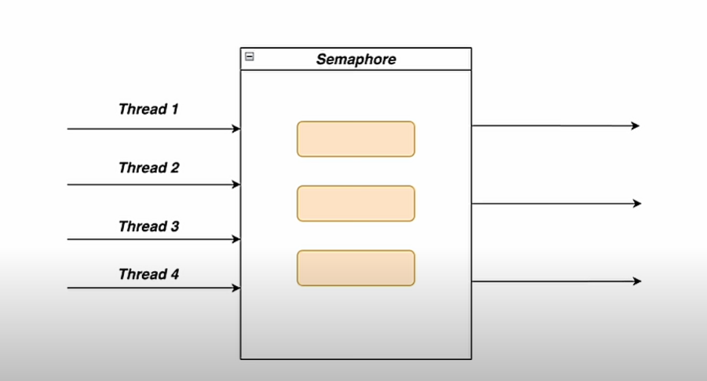

# Semaphore

We use semaphore to restrict the no of threads that use a service. It is used reusable tokens to archive that.



```
    private final Semaphore semaphore = new Semaphore(3);

    public void scrape() {
        try {
            semaphore.acquire();
            invokeBot();
        } catch (InterruptedException e) {
            throw new RuntimeException(e);
        } finally {
            semaphore.release();
        }
    }

    private void invokeBot() throws InterruptedException {
        System.out.println("Scraping the web site...");
        Thread.sleep(1000);
    }
```

We can acquire more than one token at a time. by passing the no of required tokens. With that scenario, we have to release same no of tokens as well.