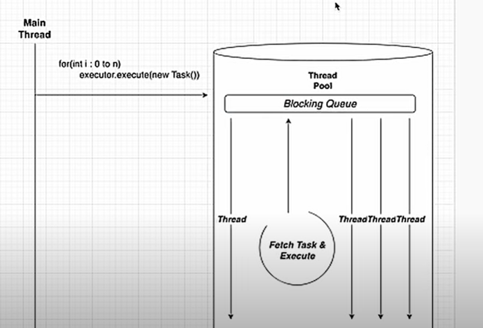

# Thread Executor

When we need to run several task parallel, we create threads for each task.
One thread is equal to one OS level thread. so creating a thread is quite expensive.
Hench creating threads for each task is not a recommended way when there are many tasks to do.

For such scenario, we can create a pool of threads which is containing fixed no of threads and is called as ```thread pool```.

Executor service can be used to manage that thread pool.
As the general scenarios, threads are not killed after executed the task. it is assigned for another task by saving thread creation time.

There are four type of executors.
    
    i. Single Thread Executor
    ii. Fixed Thread Pool Executor
    iii. Cached Thread Pool
    iv. Scheduled Executor



### Cached Thread Pool

There is not fixed number of threads. When task is waiting for a thread, the executor service creates a thread and assign
it to that task. That's how threads are created. And when threads are being idle, after some waiting time those threads are 
terminated.

#### Scheduled Executor

There are two ways to terminate the process. 

    i. shutdown()
    ii. shutdownNow()

The difference between above two is,
when we use ```shutdown()``` it allows to add tasks to queue and current thread is shutdown. 

But we use ```shutdownNow()``` it stop all tasks and all are terminated.