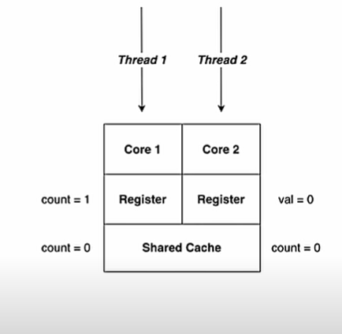

# Volatile Keyword



As the above image shows, when thread 2 read the value it got value as 0 not the 1. because updated value is still in register of core 1 not in the shared cache.

So for such scenarios we can use ```volatile``` keyword. It what does is, update and flush to the shared cache.
But this keyword make performance latency as well.